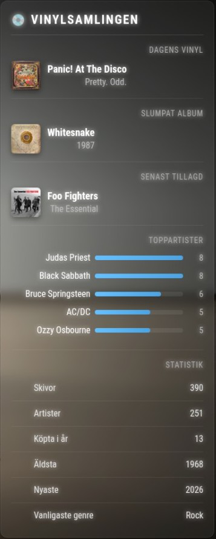

# MMM-VinylCollection

MagicMirror² module that displays your Discogs vinyl collection with beautiful stats, random album, and today's pick.

---

## 📸 Preview



---

## ✨ Features

* 📀 Today's vinyl
* 🎲 Random album
* 🆕 Latest added
* 📊 Statistics overview
* 🎤 Top artists with visual bars
* 🌍 Multi-language support
* ⚙️ Per-module language override (NEW)

---

## 🌍 Language Support

This module supports multiple languages using MagicMirror's built-in language system.

### Supported languages:

* 🇸🇪 Swedish
* 🇬🇧 English

---

### 🧭 Option 1: Use MagicMirror global language

Set language in your main `config.js`:

```javascript
language: "sv" // or "en"
```

The module will automatically follow this setting.

---

### ⚙️ Option 2: Override language per module (NEW)

You can force a specific language **only for this module**:

```javascript
{
  module: "MMM-VinylCollection",
  position: "top_right",
  config: {
    username: "YOUR_DISCOGS_USERNAME",
    token: "YOUR_DISCOGS_TOKEN",
    language: "en" // 🔥 overrides global language
  }
}
```

If not set, the module falls back to MagicMirror’s global language.

---

## 📦 Installation

```bash
cd ~/MagicMirror/modules
git clone https://github.com/dentrass/MMM-VinylCollection.git
cd MMM-VinylCollection
npm install
```

---

## ⚙️ Configuration

Basic setup:

```javascript
{
  module: "MMM-VinylCollection",
  position: "top_right",
  config: {
    username: "YOUR_DISCOGS_USERNAME",
    token: "YOUR_DISCOGS_TOKEN"
  }
}
```

---

## 🔄 Update Intervals (optional)

```javascript
config: {
  username: "YOUR_USERNAME",
  token: "YOUR_TOKEN",
  updateInterval: 43200000,      // 12 hours
  randomAlbumInterval: 900000    // 15 minutes
}
```

---

## 🔑 Get Discogs Token

1. Go to: https://www.discogs.com/settings/developers
2. Generate a personal access token
3. Paste it into your config

---

## 📁 File Structure

```
MMM-VinylCollection/
├── MMM-VinylCollection.js
├── node_helper.js
├── vinyl.css
├── translations/
│   ├── en.json
│   └── sv.json
├── package.json
└── README.md
```

---

## ⚡ Performance

* Uses caching (6 hours) to minimize API calls
* Fetches full collection only when needed
* Smooth UI updates

---

## 📦 Dependencies

* No external dependencies (uses native fetch)

---

## 🧠 Data Source

Powered by the Discogs API:
https://www.discogs.com/developers

---

## 👨‍💻 Author

**dentrass**

---

## ⭐ Contribute

Feel free to:

* Add more languages 🌐
* Improve UI 🎨
* Suggest features 💡

Pull requests are welcome!

---

## 📜 License

MIT License
